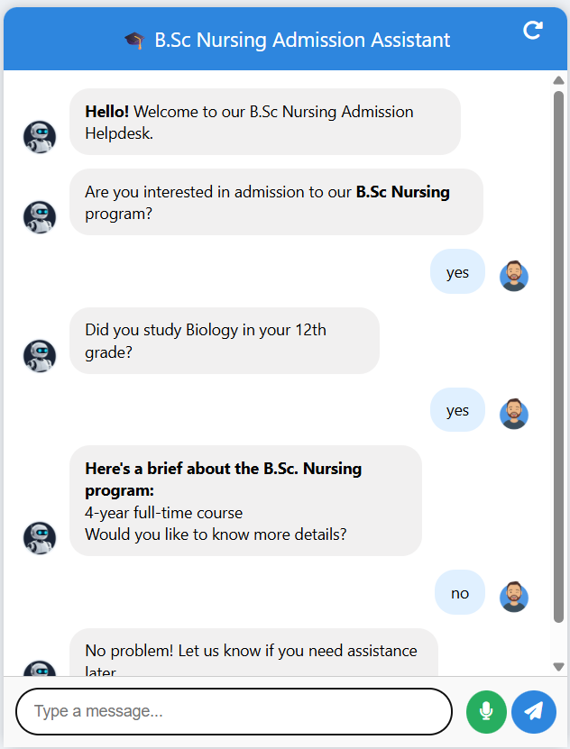
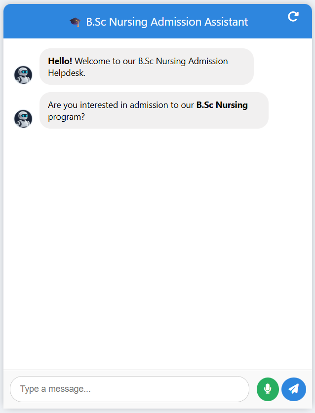
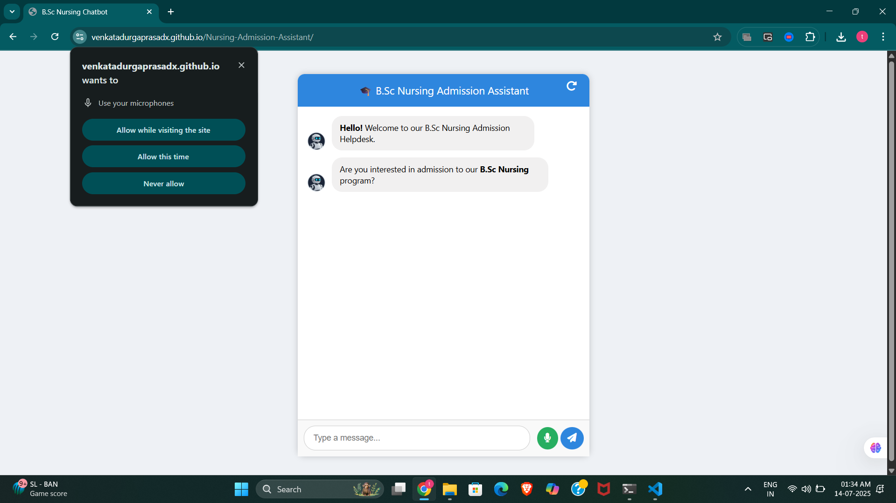

# 🤖 Prompt Engineering Assignment – LiaPlus AI

🚀 **Live Demo**: [Click here to try the chatbot](https://venkatadurgaprasadx.github.io/Nursing-Admission-Assistant/)

> 🎓 Intelligent conversational assistant for B.Sc Nursing Admissions with voice input, structured logic, and modern UI.

---

## 🧑‍💻 Submitted By
- **Name**: Tattukolla Venkata Durga Prasad  
- **Registration No.**: 12220336  
- **Program**: B.Tech – Computer Science and Engineering  
- **University**: Lovely Professional University, Punjab  
- **Email**: venkatadurgaprasad04@gmail.com  
- **Submission Date**: 13 July 2025  

---

## 🎯 Objective

To design an intuitive and intelligent conversational assistant that:

- Engages students professionally  
- Handles varied user responses effectively  
- Communicates program information clearly  
- Simulates a real-world AI-based admission counselor  

---

## 📌 Key Features

- ✅ Structured Step-by-Step Chat Flow  
- 🧪 Eligibility Filtering Based on Biology in 12th  
- 💰 Detailed Fee Breakdown with Installment Plan  
- 🏠 Hostel, Training, Location & Recognition Info  
- 🎓 Scholarship Info & Seat Availability  
- 📄 Admission Criteria Summary  
- 🔄 User-Friendly Fallback Handling  
- 📤 Voice Input and Chat Reset Option  

---

## 🧠 Tools & Technologies Used

- HTML, CSS, JavaScript  
- Web Speech API for voice input  
- Font Awesome for icons  
- Modular JS logic with chatbot state handling  
- Responsive UI design

---

## 💡 Innovations Added

### 🔤 Multilingual Support (Planned)
Language selection feature proposed for Hindi, Telugu, and more to improve accessibility for non-English speakers.

### 📊 Analytics for Future Improvement
Future integration plan includes:
- Drop-off step tracking  
- Feedback-based assistant optimization  

---

## 🖼️ Project Screenshots

| Chat Start | Voice Input | Eligibility Flow |
|------------|-------------|------------------|
|  |  |  |

---

## 📎 Files Included

| File                        | Description                                |
|-----------------------------|--------------------------------------------|
| `index.html`                | Main chatbot UI structure                  |
| `style.css`                 | Modern responsive styling                  |
| `script.js`                 | Core chatbot logic with steps              |
| `LiaPlus_AI_Assistant.pdf` | Full conversational flow with explanations |
| `flowchart.png`             | Flowchart of the conversation structure    |
| `README.md`                 | Project overview (you’re reading it)       |
| `screenshots/`              | Chatbot demo screenshots                   |

---

## 🏁 Conclusion

This conversational assistant is a powerful example of how AI-inspired chat design can streamline and humanize the admission process.  
With voice input, smart logic handling, and future-ready multilingual capability, it ensures clarity, comfort, and engagement for prospective students.

> “Designing conversations that feel human, helpful, and honest.”

---

## 📬 Contact

📧 venkatadurgaprasad04@gmail.com  
🔗 [LinkedIn (Optional)](https://www.linkedin.com/in/venkata-durga-prasad/)  
🌐 [Live Demo](https://your-username.github.io/repo-name/)

---
